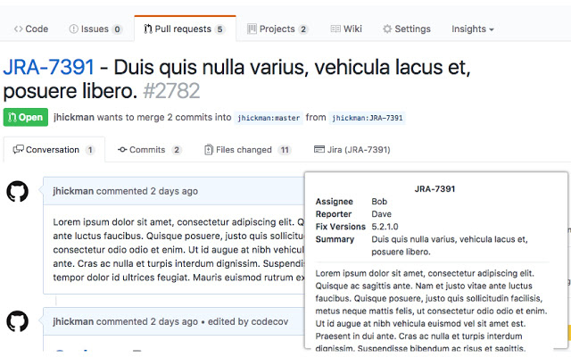
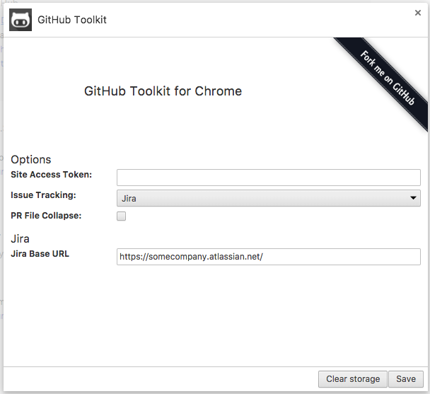

## GitHub Toolkit Browser Extension
Browser extension (Currently available for Chrome) to add extra functionality to GitHub.  

Features:

* Integration with Task Management systems (currently works only for Atlassian Jira)
  * Additional tab in pull requests for detail info
  * Tooltip with compact ticket info on project pages
* Supports private repositories
* Pull request timelines
  * To help identify bottlenecks in process
  
Check out the [Changelog](HISTORY.md) for up to date information.

### Install on Chrome
* Install GitHub Toolkit from [Chrome Web Store](https://chrome.google.com/webstore/detail/github-toolkit/hbidobmnkcpdcoglncooejdnjlkglpmd)
* Navigate to any GitHub repository

## Settings

The settings should be fairly straight forward, but this section describes the purpose of each setting.

### Site Access Token

GitHub Toolkit stores access tokens in your browser local storage and never transmits it anywhere. If you want to verify, check out the source.

#### GitHub
GitHub Toolkit uses [GitHub API](https://developer.github.com/v3/) to retrieve repository metadata. must be authenticated:

### Issue Tracking

Currently only Jira is supported, but in the future the dropdown will contain each supported system.

#### Jira 

The Atlassian Jira Base URL is the server URL used for REST calls to the Jira API.
